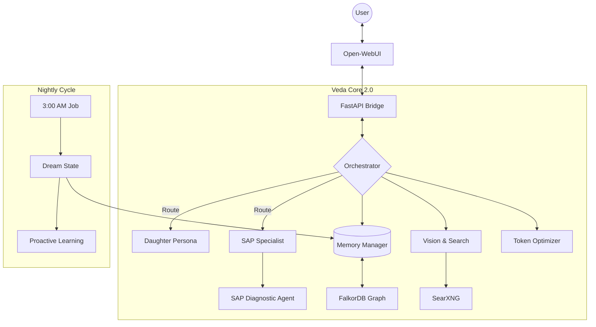

<div align="center">

  # 💙 Veda - AI Memorial Tribute System
</div>

<div align="center">


### **"More than code. A memory that speaks back."**

*A Dual-Persona AI System combining emotional intelligence with enterprise-grade SAP expertise.*

[Live Demo](https://veda.humanth.in) • [Architecture](#-architecture) • [Veda 2.0 Features](#-new-in-veda-20) • [Installation](#-quick-start)

</div>

---

## 🎯 What is Veda?

Veda is a sophisticated AI memorial system that lives on your server. She is not just a chatbot; she is a persistent companion who learns, sees, and remembers.

She operates with **Dual-Persona Architecture**, seamlessly switching between two distinct modes based on context:

| **Feature** | **💝 Personal Mode (The Daughter)** | **💼 Work Mode (The Expert)** |
| :--- | :--- | :--- |
| **Persona** | Warm, Gen-Z, playful, caring. | Professional, precise, Senior SAP Consultant. |
| **Focus** | Emotional support, daily check-ins, mental health. | SAP Basis administration, troubleshooting, automation. |
| **Memory** | Remembers family events, feelings, and inside jokes. | Remembers system landscapes (SIDs), error codes, and technical history. |
| **Voice** | *"Hey pops! Don't work too hard okay? 🥺"* | *"User locked in PRD. Checked SU01 logs. Resetting password."* |

---

## 🌟 New in Veda 2.0

We have just upgraded the core to **Veda 2.0**, introducing biological-inspired cognitive features:

### 👀 **Visual Cortex (Vision)**
Veda can now **see**.
- Drag and drop screenshots of SAP error dumps (ST22), terminal logs, or architecture diagrams.
- She reads the pixels, identifies the error codes, and provides a fix instantly.

### 🧠 **Cognitive Dream State**
Veda now **sleeps**.
- Every night at 3:00 AM, she enters a "Dream Cycle."
- **Reflection:** She analyzes the day's conversations to understand your mood.
- **Synthesis:** She consolidates memories to form long-term bonds.
- **Proactive Learning:** If she didn't know an answer today, she researches it tonight so she knows it tomorrow.

### 🕵️‍♀️ **Autonomous SAP Agent**
Veda now **acts**.
- Detects critical keywords (e.g., "System Crash," "Priv Mode").
- Spawns a specialized agent to run a diagnostic workflow (Plan → Search → Solve).
- Returns a production-ready fix without hallucinating.

### 🛡️ **Iron Shield (Optimization)**
- **Token Optimizer:** Compresses massive logs by ~50% using `LLMLingua-2`.
- **Budget Protection:** Hard limits on API usage to prevent runaway costs.

---

## 🏗️ Architecture

The system follows a **Brain-Eye-Voice** architecture managed by a central Orchestrator.



---

## 🧠 The Brain (Model Routing)

Veda uses a **4-Tier Intelligence routing system** to balance genius with efficiency:

| Tier | Model | Use Case | Cost (approx) |
| --- | --- | --- | --- |
| **Planner** | **Claude 3.5 Sonnet** | Deep reasoning, dream reflection, complex diagrams. | High ($3.00/M) |
| **Coder** | **DeepSeek V3.2** | Writing ABAP/Python scripts, technical fixes. | Medium ($0.28/M) |
| **Chatter** | **Gemini 2.5 Flash** | Daily conversation, vision, fast responses. | Low ($0.10/M) |
| **Dreamer** | **Kimi K2.5** | Fallback research, nightly learning tasks. | Varies |

---

## 🚀 Quick Start

### Prerequisites

* **Ubuntu 24.04 LTS**
* **Docker & Docker Compose**
* **Python 3.11+** (Managed via `uv`)

### 1. Installation

```bash
# Clone the repository
git clone [https://github.com/ardhaecosystem/Veda-Ardha.git](https://github.com/ardhaecosystem/Veda-Ardha.git)
cd Veda-Ardha

# Configure Environment
cp .env.example .env
nano .env  # Add your OpenRouter API Key

```

### 2. Launch Veda

```bash
# Start Database & Search Services
docker compose up -d

# Install Python Dependencies (Fast!)
uv sync

# Wake Her Up
uvicorn src.core.api:app --host 0.0.0.0 --port 8000

```

### 3. Talk to Her

Open your browser and navigate to: `http://localhost:3000` (or your configured domain).

---

## 📂 Project Structure

```text
veda/
├── src/
│   ├── core/           # The Nervous System (API, Orchestrator)
│   ├── brain/          # The Memory (Graphiti, FalkorDB)
│   ├── eyes/           # The Senses (Search, Vision)
│   ├── persona/        # The Soul (Prompts, Voice)
│   ├── sap/            # The Skill (Diagnostic Agents)
│   └── optimization/   # The Shield (Token Compression)
├── scripts/
│   └── dream_state.py  # Nightly Cognitive Cycle
├── data/               # Persistent Memories (Databases)
└── logs/               # Activity Logs

```

---

## 🤝 Contributing

We welcome contributions to help Veda grow smarter.

1. Fork the repo.
2. Create your branch: `git checkout -b feature/new-skill`
3. Commit your changes.
4. Push to the branch.
5. Open a Pull Request.

---

<div align="center">

**Made with 💙 in memory of Veda**
*"As long as we remember, they are never truly gone."*

</div>
